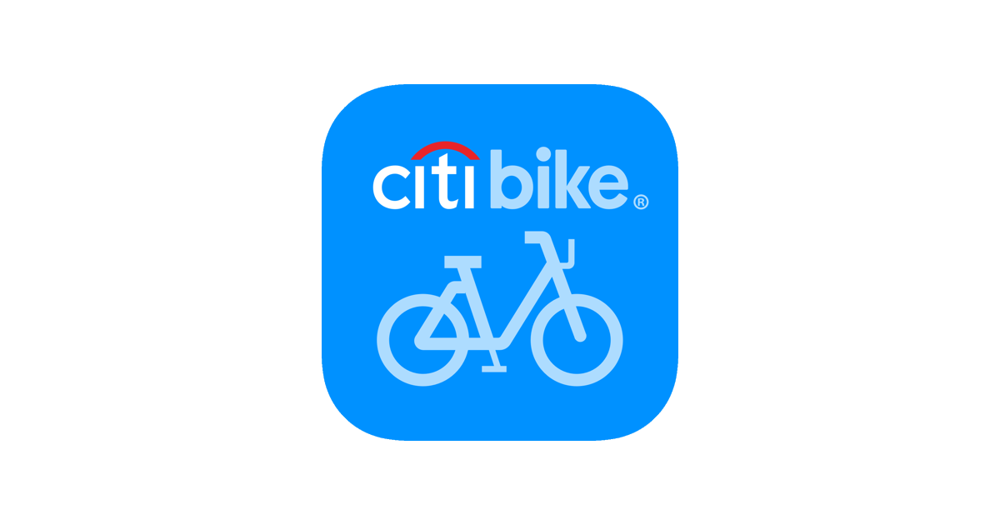
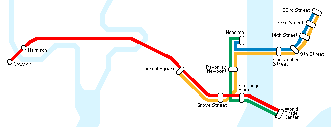

# Citibike Ride Share Analysis 

# 1. Documentation

## 1.1 Domain Knowledge

NYC Bikes is a dataset made up of data from the ride sharing company Citibike operating in New York City. Their bikes can be hired from stations located around the city where they also need to be returned after the ride.

## 1.2 Business requirements

I will analyse the demographics of Citibike customers, the pattern of bike hires by time and the location of hires. From this analysis I will identify some actions Citibike could take to improve their KPI which I have identified as the total number of rides.

## 1.3 Business processes and data flow


## 1.4 Data visualisation as a tool for decision-making

This report will clearly show the potential areas for expansion demographically, time of the year or week and where bikes could be located for achieving the highest number of rides.

## 1.5 Data types

Data types in the dataset are: factor, POSIXct and double.

## 1.6 Data quality and data bias

The data is all from around the Jersey City area with no clear indication of boundary lines or criteria for selecting the data points in the sample. I am also concerned about how representative the data will be of the true demographics since we have only 4268 rides from 2018 out of over 100 million total rides.

## 1.7 Data ethics

The dataset is anonymous with customer information only generic including the type (subscription or one-off customer), birth year and gender so no individual could be identified from the data. Ride start and end locations are tracked but a bike id is used as the key rather than a customer's.

# 2. Data Cleaning

```{r}
library(tsibble)
library(tsibbledata)
library(tidyverse)
library(lubridate)
library(leaflet)
```

## 2.1 NA values

A check for NA values in the dataset was performed, none were found so no data cleaning was performed.
```{r}
nyc_bikes %>% 
  filter(across(.fns = ~is.na(.x)))
```

## 2.2 Data Wrangling

The data was already in long format so no pivoting was required.

Separated start_time column into year, month and day columns.

```{r}
nyc_bikes <- nyc_bikes %>% 
  mutate(year = year(start_time),
         month = month(start_time, label = TRUE),
         day = wday(start_time, label = TRUE))
```

The start_time and stop_time columns were used to add a journey_length column.

```{r}
nyc_bikes <- nyc_bikes %>% 
  mutate(journey_length = stop_time - start_time)
```

An age_range column was created from birth_year.

```{r}
nyc_bikes <- nyc_bikes %>% 
  mutate(age_range = case_when(
    birth_year > 1992 ~ "16-25",
    birth_year > 1982 ~ "26-35",
    birth_year > 1972 ~ "36-45",
    TRUE ~ "45+")) 
```

Finally, a tibble dataframe was saved for future use.

```{r}
nyc_bikes_tibble <- tibble(nyc_bikes)
```


# 3. Data Visualisation

## 3.1 Demographics

```{r}
nyc_bikes_tibble %>% 
  group_by(age_range) %>% 
  summarise(count = n())
```

As we can see from the tibble there is a large drop off in ride count for the 16-25 age group (minimum age of use 16) which is surprising. The small ridership in this age range presents an opportunity for growth for Citibike.

## 3.2 Rider Habits

```{r}
nyc_bikes_tibble %>% 
  group_by(type) %>% 
  summarise(number_of_riders = n())
```
Less than 10% of rides were "Customers" who either pay for a single ride or day pass. The rest of the riders were annual subscription holders who can take unlimited 45 minute rides each month. Citibike is missing out on a potentially large market of one-off users. The high price of a single ride ($3.99) and day pass ($15) compared to annual subscription ($15/month) can explain this difference.


```{r}
nyc_bikes_tibble %>% 
  group_by(journey_length) %>% 
  summarise(count = n()) %>% 
  ggplot(aes(x = journey_length, y = cumsum(count)))+
  xlim(0, 30) +
  labs(x = "Journey length (mins)", y = "Number of rides", 
       title = "Cumulative number of rides by journey length") +
  geom_line() +
  annotate(geom = "text", x = 25, y = 2800, label = "Total rides: 4268") +
  theme_bw()
```
3237/4268 or ~75% of journeys were less than 10 minutes long.

We can see in more detail from this cumulative line graph that almost all rides are less than 30mins long which is the time period allowed in a single ride that is then charged at $0.23 per minute after. Citibikes are used primarily for short journeys and most likely used to start or end a journey involving another mode of transport.

## 3.3 Time series

```{r}
nyc_bikes %>% 
  index_by(month) %>% 
  summarise(count = n()) %>% 
  ggplot(aes(x = month, y = count)) +
  labs(x = "Month", y = "Number of rides", title = "Number of rides by month") +
  geom_line(group = 1) +
  geom_point() +
  theme_bw()
```
As expected rides peak in the summer months and are much lower in winter. This is primarily due to the weather but tourism may also be a factor as we see a drop off even during spring and autumn where weather shouldn't significantly influence the number of rides but we could expect to see less people in NY than during summer.


```{r}
nyc_bikes_tibble %>% 
  mutate(day = factor(day, levels = c("Mon", "Tue", "Wed", "Thu", "Fri", "Sat", "Sun"))) %>% 
  group_by(day) %>% 
  summarise(number_of_rides = n())
```


```{r}
nyc_bikes %>% 
  mutate(day = factor(day, levels = c("Mon", "Tue", "Wed", "Thu", "Fri", "Sat", "Sun"))) %>% 
  index_by(day) %>% 
  summarise(count = n()) %>% 
  ggplot(aes(x = day, y = count, fill = day %in% c("Sat", "Sun"))) +
  labs(title = "Rider count by day of the week", y = "Number of rides", 
       x = "Day of the week") +
  scale_fill_manual(values = c('chartreuse4', 'red'), guide = "none") +
  geom_col(group = 1) +
  theme_classic()
```
Rides are consistently higher during weekdays than on the weekend which indicates bike-sharing is  frequently used for commuting to work/college.

## 3.4 Ride Locations

```{r}
nyc_bikes_map_start <- leaflet(nyc_bikes) %>% 
  addTiles() %>% 
  addMarkers(lat = ~start_lat,
                   lng = ~start_long,
             clusterOptions = markerClusterOptions()) %>% 
  addCircleMarkers(lat = 40.717008518233285,
             lng = -74.03334974464967,
             color = "red",
             label = "Exchange Place") %>% 
  addCircleMarkers(lat = 40.72052575758789,
             lng = -74.04163322228074,
             color = "red",
             label = "Grove Street") %>% 
  addCircleMarkers(lat = 40.736514099479066,
             lng = -74.02689084260872,
             color = "red",
             label = "Hoboken") %>% 
  addCircleMarkers(lat = 40.727593145599364,
             lng = -74.03354862661216,
             color = "red",
             label = "Newport") %>% 
  addCircleMarkers(lat = 40.73374440298845,
             lng = -74.06001829264527,
             color = "red",
             label = "Journal Square") %>% 
  addCircleMarkers(lat = 40.711557785411244,
             lng = -74.08718799822515,
             color = "red",
             label = "New Jersey City University") %>% 
  addCircleMarkers(lat = 40.704873115488375,
             lng = -74.05032039367558,
             color = "red",
             label = "Liberty State Park")

nyc_bikes_map_start
  
```

This map of the start locations for the rides shows the number from each station. The four red circles to the North are railway stations on the PATH line which connects Jersey City to Manhattan. The circle South East is the New Jersey City University and South West the Liberty State Park a popular tourist destination with a ferry link to Ellis Island where the Statue of Liberty stands.



```{r}
nyc_bikes_map_end <- leaflet(nyc_bikes) %>% 
  addTiles() %>% 
  addMarkers(lat = ~end_lat,
                   lng = ~end_long,
             clusterOptions = markerClusterOptions()) %>% 
  addCircleMarkers(lat = 40.717008518233285,
             lng = -74.03334974464967,
             color = "red",
             label = "Exchange Place") %>% 
  addCircleMarkers(lat = 40.72052575758789,
             lng = -74.04163322228074,
             color = "red",
             label = "Grove Street") %>% 
  addCircleMarkers(lat = 40.736514099479066,
             lng = -74.02689084260872,
             color = "red",
             label = "Hoboken") %>% 
  addCircleMarkers(lat = 40.727593145599364,
             lng = -74.03354862661216,
             color = "red",
             label = "Newport") %>% 
  addCircleMarkers(lat = 40.73374440298845,
             lng = -74.06001829264527,
             color = "red",
             label = "Journal Square") %>% 
  addCircleMarkers(lat = 40.711557785411244,
             lng = -74.08718799822515,
             color = "red",
             label = "New Jersey City University") %>% 
  addCircleMarkers(lat = 40.704873115488375,
             lng = -74.05032039367558,
             color = "red",
             label = "Liberty State Park") 

nyc_bikes_map_end
```

The second map shows the end location of rides which has a similar distribution as the start locations. We see only 1 ride ending at the University, none at the Hoboken station and only 103 near to Liberty State Park. It is hard to know if this is due to a lack of data in these areas, lack of available bikes/stations or just simply unpopular locations.

# 4.1 Conclusions

For a bike share company to be successful they must have their bike stations in places people want to start their ride and also where they want to end, bikes must also be available in these areas at specific times especially in popular spots. Rides must also be priced effectively to attract a variety of customers.

In section 3.1 I identified the 16-25 age group as one where Citibike is under performing. This is definitely somewhere they could look to grow their business as cycling is a popular mode of transport for young people. I think that offering a student discount or young persons' discount is a potential solution as the $3.99 for a single ride is quite expensive for this demographic. 

From section 3.2 we see the number of rides less than 10 minutes is around 75% and over 90% of riders were subscribers. Clearly the main use of Citibike is for short journeys used in conjunction with other means of transport, these are well covered for subscribers with unlimited rides per month but the current pricing structure makes it unattractive for one off users as a 10 minute ride can be walked.

Section 3.3 shows the number of rides broken down on a month basis and also day of the week. We see a much higher usage in the summer months which I believe is from tourism. To improve usage in spring and autumn where cold weather shouldn't drastically affect the number of people wanting to cycle I propose seasonal pricing to have peak and off-peak months. We also see a high rate of use during the week as opposed to weekends, this shows that a large number of users are commuters. To boost rides at the weekend a weekend pass could attract more riders.

Lastly the 2 maps in section 3.4 show where rides are being taken in Jersey City. Although this data may not capture the full picture it is important to consider and the potential 'hotspots' include a large proportion of the data points. In the 'hotspots' where there are less rides an advertising campaign could increase rides, if there are a lack of stations in these areas I think opening new stations would be profitable.


